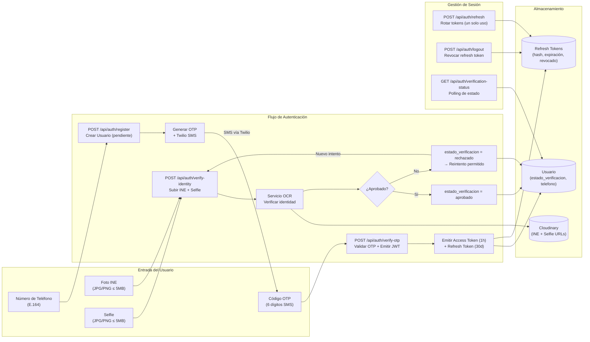

# Diagrama de Flujo de Datos — Autenticación

[//]: # (INICIO_DIAGRAMA)

```mermaid
flowchart LR
    subgraph Input["Entrada del Usuario"]
        direction TB
        Phone["Número de Teléfono\n(E.164)"]
        OTPCode["Código OTP\n(6 dígitos SMS)"]
        INEPhoto["Foto INE\n(JPG/PNG ≤ 5MB)"]
        Selfie["Selfie\n(JPG/PNG ≤ 5MB)"]
    end

    subgraph AuthFlow["Flujo de Autenticación"]
        direction TB
        Register["POST /api/auth/register\nCrear Usuario (pendiente)"]
        SendOTP["Generar OTP\n+ Twilio SMS"]
        VerifyOTP["POST /api/auth/verify-otp\nValidar OTP + Emitir JWT"]
        IssueTokens["Emitir Access Token (1h)\n+ Refresh Token (30d)"]
        UploadID["POST /api/auth/verify-identity\nSubir INE + Selfie"]
        IDVerify["Servicio OCR\nVerificar identidad"]
        IDResult{"¿Aprobado?"}
        Approved["estado_verificacion = aprobado"]
        Rejected["estado_verificacion = rechazado\n→ Reintento permitido"]
    end

    subgraph Session["Gestión de Sesión"]
        direction TB
        Refresh["POST /api/auth/refresh\nRotar tokens (un solo uso)"]
        Logout["POST /api/auth/logout\nRevocar refresh token"]
        VerifyPoll["GET /api/auth/verification-status\nPolling de estado"]
    end

    subgraph Storage["Almacenamiento"]
        direction TB
        UserDB[("Usuario\n(estado_verificacion, telefono)")]
        TokenDB[("Refresh Tokens\n(hash, expiración, revocado)")]
        ImageStore[("Cloudinary\n(INE + Selfie URLs)")]
    end

    Phone --> Register
    Register --> SendOTP
    SendOTP -->|"SMS vía Twilio"| OTPCode
    OTPCode --> VerifyOTP
    VerifyOTP --> IssueTokens
    IssueTokens --> UserDB
    IssueTokens --> TokenDB

    INEPhoto --> UploadID
    Selfie --> UploadID
    UploadID --> IDVerify
    IDVerify --> ImageStore
    IDVerify --> IDResult
    IDResult -- "Sí" --> Approved
    IDResult -- "No" --> Rejected
    Approved --> UserDB
    Rejected --> UserDB
    Rejected -->|"Nuevo intento"| UploadID

    VerifyPoll --> UserDB
    Refresh --> TokenDB
    Logout --> TokenDB
```
