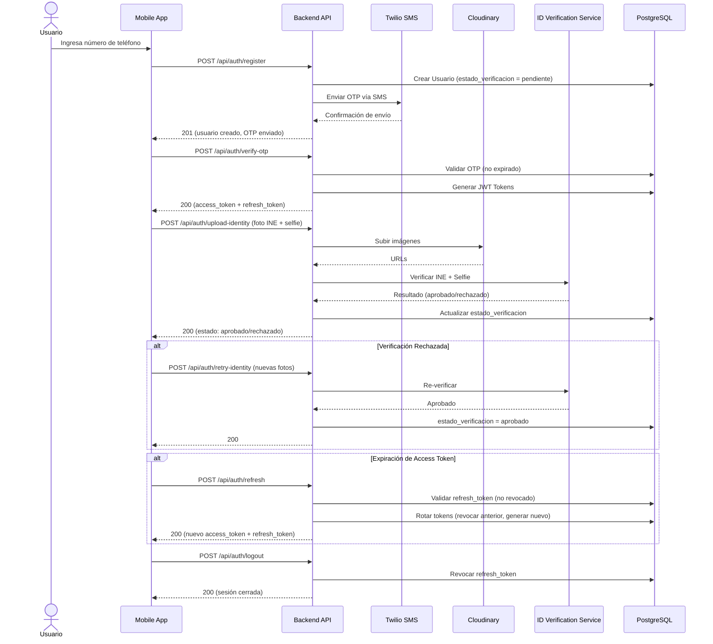

# Diagrama de Autenticación (Auth Sequence)

[//]: # (INICIO_DIAGRAMA)

```mermaid
sequenceDiagram
    actor User as Usuario
    participant App as Mobile App
    participant API as Backend API
    participant Twilio as Twilio SMS
    participant Cloudinary as Cloudinary
    participant OCRService as ID Verification Service
    participant DB as PostgreSQL

    %% Registro
    User->>App: Ingresa número de teléfono
    App->>API: POST /api/auth/register
    API->>DB: Crear Usuario (estado_verificacion = pendiente)
    API->>Twilio: Enviar OTP vía SMS
    Twilio-->>API: Confirmación de envío
    API-->>App: 201 (usuario creado, OTP enviado)

    %% Verificación OTP
    App->>API: POST /api/auth/verify-otp
    API->>DB: Validar OTP (no expirado)
    API->>DB: Generar JWT Tokens
    API-->>App: 200 (access_token + refresh_token)

    %% Verificación de Identidad
    App->>API: POST /api/auth/upload-identity (foto INE + selfie)
    API->>Cloudinary: Subir imágenes
    Cloudinary-->>API: URLs
    API->>OCRService: Verificar INE + Selfie
    OCRService-->>API: Resultado (aprobado/rechazado)
    API->>DB: Actualizar estado_verificacion
    API-->>App: 200 (estado: aprobado/rechazado)

    %% Reintento si rechazado
    alt Verificación Rechazada
        App->>API: POST /api/auth/retry-identity (nuevas fotos)
        API->>OCRService: Re-verificar
        OCRService-->>API: Aprobado
        API->>DB: estado_verificacion = aprobado
        API-->>App: 200
    end

    %% Login (Refresh Token)
    alt Expiración de Access Token
        App->>API: POST /api/auth/refresh
        API->>DB: Validar refresh_token (no revocado)
        API->>DB: Rotar tokens (revocar anterior, generar nuevo)
        API-->>App: 200 (nuevo access_token + refresh_token)
    end

    %% Logout
    App->>API: POST /api/auth/logout
    API->>DB: Revocar refresh_token
    API-->>App: 200 (sesión cerrada)
```
