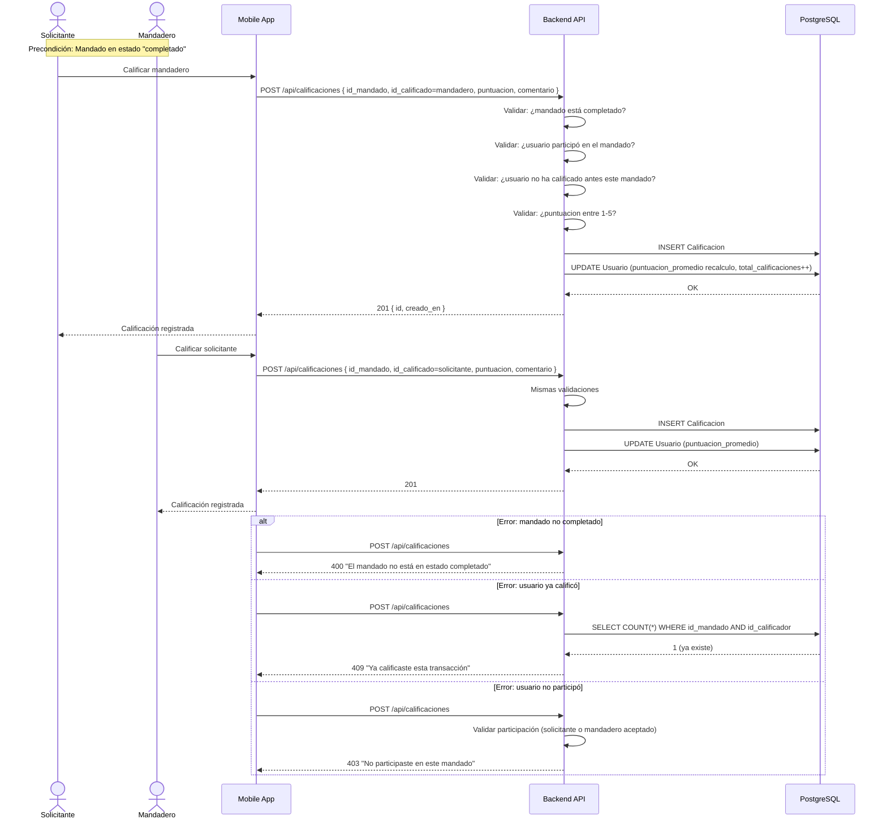

# Diagrama de Secuencia — Calificaciones

[//]: # (INICIO_DIAGRAMA)

```mermaid
sequenceDiagram
    actor Solicitante as Solicitante
    actor Mandadero as Mandadero
    participant App as Mobile App
    participant API as Backend API
    participant DB as PostgreSQL

    %% Precondición: mandado completado
    Note over Solicitante,Mandadero: Precondición: Mandado en estado "completado"

    %% Solicitante califica al mandadero
    Solicitante->>App: Calificar mandadero
    App->>API: POST /api/calificaciones { id_mandado, id_calificado=mandadero, puntuacion, comentario }
    API->>API: Validar: ¿mandado está completado?
    API->>API: Validar: ¿usuario participó en el mandado?
    API->>API: Validar: ¿usuario no ha calificado antes este mandado?
    API->>API: Validar: ¿puntuacion entre 1-5?
    API->>DB: INSERT Calificacion
    API->>DB: UPDATE Usuario (puntuacion_promedio recalculo, total_calificaciones++)
    DB-->>API: OK
    API-->>App: 201 { id, creado_en }
    App-->>Solicitante: Calificación registrada

    %% Mandadero califica al solicitante (mismo flujo)
    Mandadero->>App: Calificar solicitante
    App->>API: POST /api/calificaciones { id_mandado, id_calificado=solicitante, puntuacion, comentario }
    API->>API: Mismas validaciones
    API->>DB: INSERT Calificacion
    API->>DB: UPDATE Usuario (puntuacion_promedio)
    DB-->>API: OK
    API-->>App: 201
    App-->>Mandadero: Calificación registrada

    %% Errores frecuentes
    alt Error: mandado no completado
        App->>API: POST /api/calificaciones
        API-->>App: 400 "El mandado no está en estado completado"
    else Error: usuario ya calificó
        App->>API: POST /api/calificaciones
        API->>DB: SELECT COUNT(*) WHERE id_mandado AND id_calificador
        DB-->>API: 1 (ya existe)
        API-->>App: 409 "Ya calificaste esta transacción"
    else Error: usuario no participó
        App->>API: POST /api/calificaciones
        API->>API: Validar participación (solicitante o mandadero aceptado)
        API-->>App: 403 "No participaste en este mandado"
    end
```
