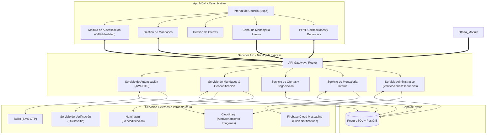

# Arquitectura de Componentes

[//]: # (INICIO_DIAGRAMA)

```mermaid
flowchart TB
    subgraph Client [App Móvil - React Native]
        direction TB
        UI["Interfaz de Usuario (Expo)"]
        Auth_Module["Módulo de Autenticación (OTP/Identidad)"]
        Mandados_Module["Gestión de Mandados"]
        Ofertas_Module["Gestión de Ofertas"]
        Chat_Module["Canal de Mensajería Interna"]
        Perfil_Module["Perfil, Calificaciones y Denuncias"]
    end

    subgraph Backend [Servidor API - Node.js & Express]
        direction TB
        API_Gateway["API Gateway / Router"]
        Auth_Service["Servicio de Autenticación (JWT/OTP)"]
        Mandados_Service["Servicio de Mandados & Geocodificación"]
        Ofertas_Service["Servicio de Ofertas y Negociación"]
        Chat_Service["Servicio de Mensajería Interna"]
        Admin_Service["Servicio Administrativo (Verificaciones/Denuncias)"]
    end

    subgraph DataLayer [Capa de Datos]
        DB[("PostgreSQL + PostGIS")]
    end

    subgraph ExternalServices [Servicios Externos e Infraestructura]
        direction LR
        Twilio["Twilio (SMS OTP)"]
        Cloudinary["Cloudinary (Almacenamiento Imágenes)"]
        Nominatim["Nominatim (Geocodificación)"]
        FCM["Firebase Cloud Messaging (Push Notifications)"]
        OCR_Service["Servicio de Verificación (OCR/Selfie)"]
    end

    %% Relaciones Cliente a Backend
    UI --> Auth_Module
    UI --> Mandados_Module
    UI --> Ofertas_Module
    UI --> Chat_Module
    UI --> Perfil_Module

    Auth_Module & Mandados_Module & Oferta_Module & Chat_Module & Perfil_Module <==> API_Gateway

    %% Relaciones Backend Internas
    API_Gateway --> Auth_Service
    API_Gateway --> Mandados_Service
    API_Gateway --> Ofertas_Service
    API_Gateway --> Chat_Service
    API_Gateway --> Admin_Service

    %% Relaciones Backend a Datos
    Auth_Service & Mandados_Service & Ofertas_Service & Chat_Service & Admin_Service <--> DB

    %% Relaciones Backend a Externos
    Auth_Service --> Twilio
    Auth_Service --> OCR_Service
    Mandados_Service --> Nominatim
    Mandados_Service --> Cloudinary
    Chat_Service --> FCM
    Admin_Service --> Cloudinary
```