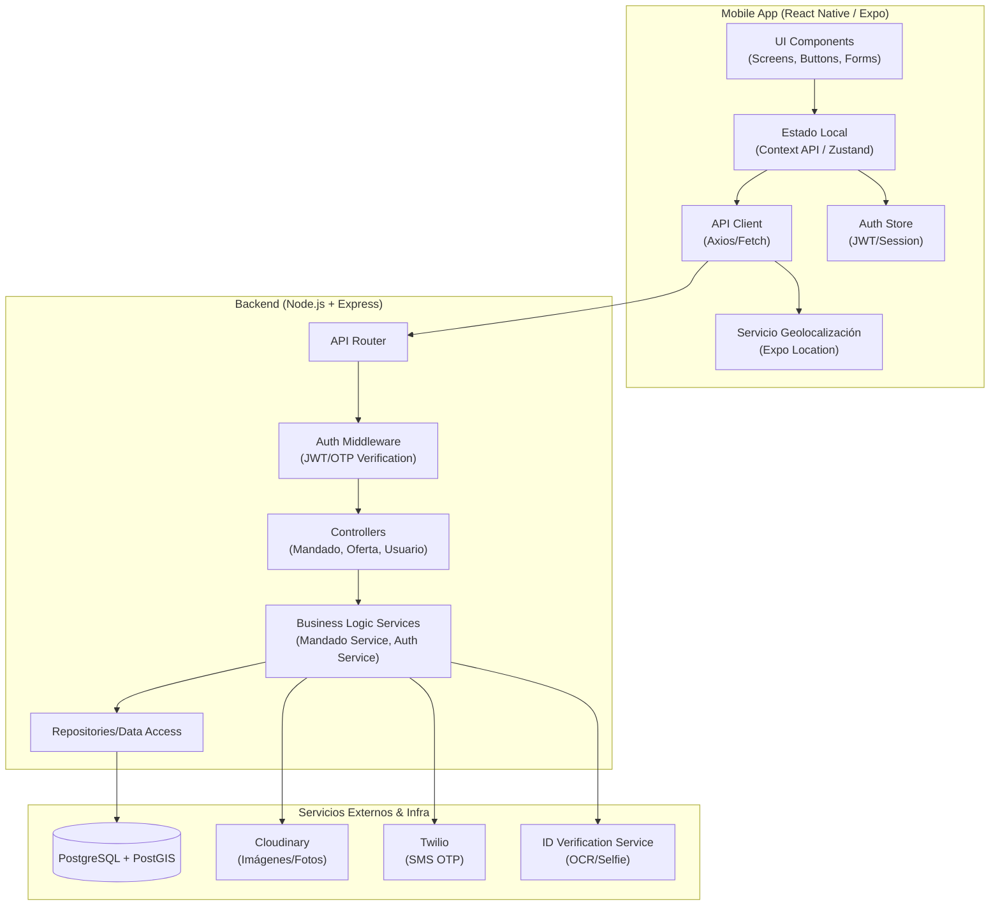

# Diagrama de Arquitectura de Componentes

[//]: # (INICIO_DIAGRAMA)

```mermaid
flowchart TB
    subgraph MobileApp ["Mobile App (React Native / Expo)"]
        direction TB
        UI["UI Components\n(Screens, Buttons, Forms)"]
        State["Estado Local\n(Context API / Zustand)"]
        APIClient["API Client\n(Axios/Fetch)"]
        AuthStore["Auth Store\n(JWT/Session)"]
        GeoService["Servicio Geolocalización\n(Expo Location)"]
        UI --> State
        State --> APIClient
        State --> AuthStore
        APIClient --> GeoService
    end

    subgraph Backend ["Backend (Node.js + Express)"]
        direction TB
        Router["API Router"]
        AuthMiddleware["Auth Middleware\n(JWT/OTP Verification)"]
        Controller["Controllers\n(Mandado, Oferta, Usuario)"]
        Service["Business Logic Services\n(Mandado Service, Auth Service)"]
        Repo["Repositories/Data Access"]
        Router --> AuthMiddleware
        AuthMiddleware --> Controller
        Controller --> Service
        Service --> Repo
    end

    subgraph ExternalServices ["Servicios Externos & Infra"]
        direction TB
        DB[("PostgreSQL + PostGIS")]
        Cloudinary["Cloudinary\n(Imágenes/Fotos)"]
        Twilio["Twilio\n(SMS OTP)"]
        AuthService["ID Verification Service\n(OCR/Selfie)"]
    end

    APIClient --> Router
    Repo --> DB
    Service --> Cloudinary
    Service --> Twilio
    Service --> AuthService
```
