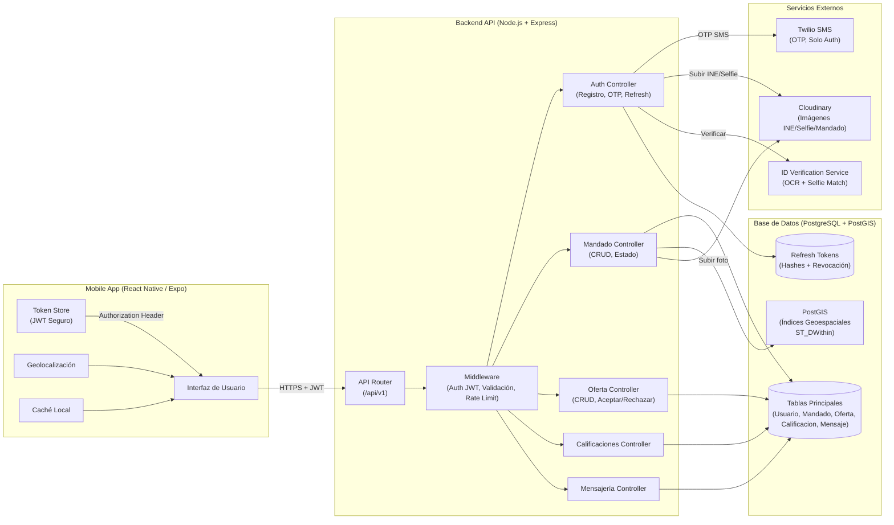

# Diagrama de Flujo de Datos — Core (Visión Global)

[//]: # (INICIO_DIAGRAMA)

```mermaid
flowchart LR
    subgraph Mobile["Mobile App (React Native / Expo)"]
        direction TB
        UI["Interfaz de Usuario"]
        AuthStore["Token Store\n(JWT Seguro)"]
        Geo["Geolocalización"]
        Cache["Caché Local"]
    end

    subgraph API["Backend API (Node.js + Express)"]
        direction TB
        Router["API Router\n(/api/v1)"]
        MW["Middleware\n(Auth JWT, Validación, Rate Limit)"]
        AuthCtrl["Auth Controller\n(Registro, OTP, Refresh)"]
        MandadoCtrl["Mandado Controller\n(CRUD, Estado)"]
        OfertaCtrl["Oferta Controller\n(CRUD, Aceptar/Rechazar)"]
        CalifCtrl["Calificaciones Controller"]
        MsgCtrl["Mensajería Controller"]
    end

    subgraph DB["Base de Datos (PostgreSQL + PostGIS)"]
        direction TB
        MainDB[("Tablas Principales\n(Usuario, Mandado, Oferta, Calificacion, Mensaje)")]
        PostGIS["PostGIS\n(Índices Geoespaciales\nST_DWithin)"]
        RToken[("Refresh Tokens\n(Hashes + Revocación)")]
    end

    subgraph External["Servicios Externos"]
        direction TB
        Twilio["Twilio SMS\n(OTP, Solo Auth)"]
        CloudinaryCDN["Cloudinary\n(Imágenes INE/Selfie/Mandado)"]
        OCRService["ID Verification Service\n(OCR + Selfie Match)"]
    end

    UI -->|"HTTPS + JWT"| Router
    Router --> MW
    MW --> AuthCtrl
    MW --> MandadoCtrl
    MW --> OfertaCtrl
    MW --> CalifCtrl
    MW --> MsgCtrl

    AuthCtrl -->|"OTP SMS"| Twilio
    AuthCtrl -->|"Subir INE/Selfie"| CloudinaryCDN
    AuthCtrl -->|"Verificar"| OCRService
    AuthCtrl --> RToken

    MandadoCtrl --> MainDB
    MandadoCtrl --> PostGIS
    MandadoCtrl -->|"Subir foto"| CloudinaryCDN

    OfertaCtrl --> MainDB
    CalifCtrl --> MainDB
    MsgCtrl --> MainDB

    AuthStore -->|"Authorization Header"| UI
    Cache --> UI
    Geo --> UI
```
