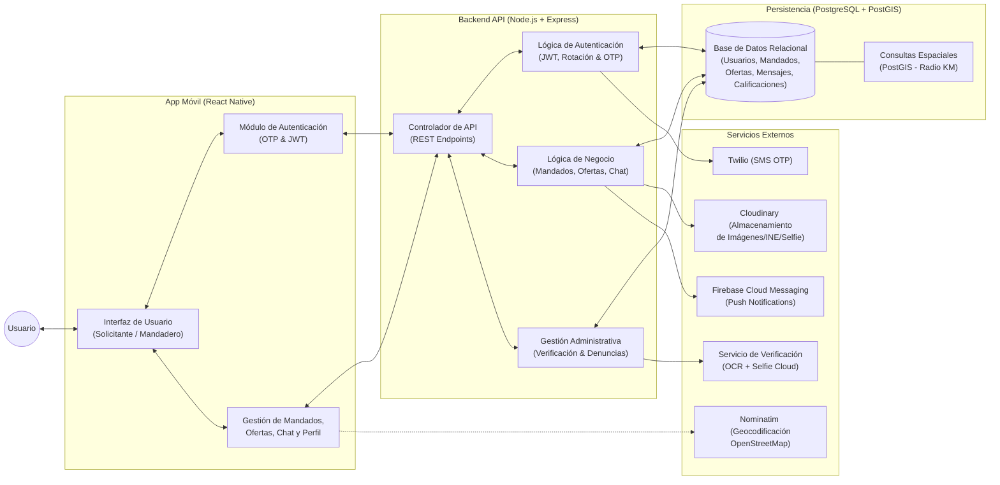

# Flujo de Datos Global

[//]: # (INICIO_DIAGRAMA)

```mermaid
flowchart LR
    subgraph Client ["App Móvil (React Native)"]
        UI["Interfaz de Usuario\n(Solicitante / Mandadero)"]
        Auth_Client["Módulo de Autenticación\n(OTP & JWT)"]
        Feature_Client["Gestión de Mandados,\nOfertas, Chat y Perfil"]
    end

    subgraph Backend ["Backend API (Node.js + Express)"]
        API_Gateway["Controlador de API\n(REST Endpoints)"]
        Auth_Logic["Lógica de Autenticación\n(JWT, Rotación & OTP)"]
        Business_Logic["Lógica de Negocio\n(Mandados, Ofertas, Chat)"]
        Admin_Logic["Gestión Administrativa\n(Verificación & Denuncias)"]
    end

    subgraph DB ["Persistencia (PostgreSQL + PostGIS)"]
        Database[("Base de Datos Relacional\n(Usuarios, Mandados,\nOfertas, Mensajes, Calificaciones)")]
        Spatial_Queries["Consultas Espaciales\n(PostGIS - Radio KM)"]
    end

    subgraph External ["Servicios Externos"]
        Twilio["Twilio (SMS OTP)"]
        Cloudinary["Cloudinary (Almacenamiento\nde Imágenes/INE/Selfie)"]
        Nominatim["Nominatim (Geocodificación\nOpenStreetMap)"]
        FCM["Firebase Cloud Messaging\n(Push Notifications)"]
        ID_Service["Servicio de Verificación\n(OCR + Selfie Cloud)"]
    end

    %% Interacciones Usuario-App
    User((Usuario)) <--> UI
    UI <--> Auth_Client
    UI <--> Feature_Client

    %% Interacciones App-Backend
    Auth_Client <--> API_Gateway
    Feature_Client <--> API_Gateway
    API_Gateway <--> Auth_Logic
    API_Gateway <--> Business_Logic
    API_Gateway <--> Admin_Logic

    %% Interacciones Backend-DB
    Auth_Logic <--> Database
    Business_Logic <--> Database
    Admin_Logic <--> Database
    Database --- Spatial_Queries

    %% Interacciones Backend-Servicios Externos
    Auth_Logic --> Twilio
    Business_Logic --> Cloudinary
    Business_Logic --> FCM
    Admin_Logic --> ID_Service
    Feature_Client -.-> Nominatim
```