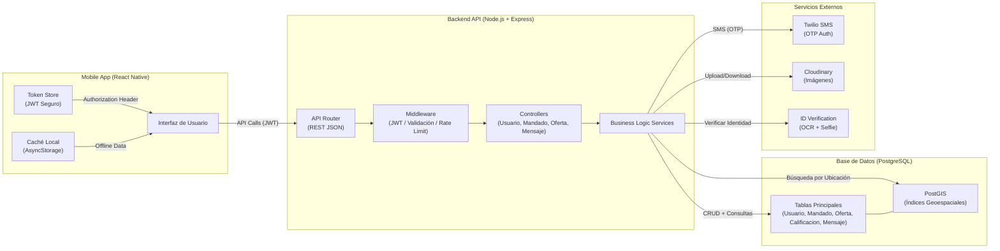

# Diagrama de Flujo de Datos

[//]: # (INICIO_DIAGRAMA)

```mermaid
flowchart LR
    subgraph Mobile ["Mobile App (React Native)"]
        direction LR
        UI["Interfaz de Usuario"]
        Cache["Caché Local\n(AsyncStorage)"]
        JWTStore["Token Store\n(JWT Seguro)"]
    end

    subgraph API["Backend API (Node.js + Express)"]
        direction LR
        Router["API Router\n(REST JSON)"]
        Middleware["Middleware\n(JWT / Validación / Rate Limit)"]
        Controllers["Controllers\n(Usuario, Mandado, Oferta, Mensaje)"]
        Services["Business Logic Services"]
    end

    subgraph DB["Base de Datos (PostgreSQL)"]
        direction LR
        MainDB["Tablas Principales\n(Usuario, Mandado, Oferta, Calificacion, Mensaje)"]
        PostGIS["PostGIS\n(Índices Geoespaciales)"]
    end

    subgraph External["Servicios Externos"]
        direction LR
        TwilioSMS["Twilio SMS\n(OTP Auth)"]
        CloudinaryCDN["Cloudinary\n(Imágenes)"]
        OCRService["ID Verification\n(OCR + Selfie)"]
    end

    UI -->|"API Calls (JWT)"| Router
    Router --> Middleware
    Middleware --> Controllers
    Controllers --> Services
    
    Services -->|"CRUD + Consultas"| MainDB
    Services -->|"Búsqueda por Ubicación"| PostGIS
    MainDB --- PostGIS

    Services -->|"SMS (OTP)"| TwilioSMS
    Services -->|"Upload/Download"| CloudinaryCDN
    Services -->|"Verificar Identidad"| OCRService

    JWTStore -->|"Authorization Header"| UI
    Cache -->|"Offline Data"| UI
```
