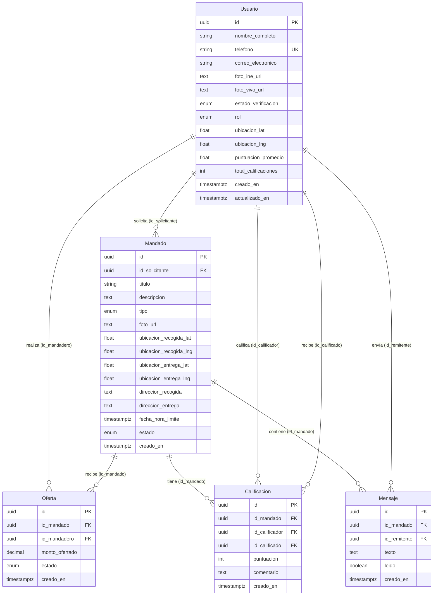

# Diagrama Entidad-Relación

[//]: # (INICIO_DIAGRAMA)

```mermaid
erDiagram
    Usuario {
        uuid id PK
        string nombre_completo
        string telefono UK
        string correo_electronico
        text foto_ine_url
        text foto_vivo_url
        enum estado_verificacion
        enum rol
        float ubicacion_lat
        float ubicacion_lng
        float puntuacion_promedio
        int total_calificaciones
        timestamptz creado_en
        timestamptz actualizado_en
    }

    Mandado {
        uuid id PK
        uuid id_solicitante FK
        string titulo
        text descripcion
        enum tipo
        text foto_url
        float ubicacion_recogida_lat
        float ubicacion_recogida_lng
        float ubicacion_entrega_lat
        float ubicacion_entrega_lng
        text direccion_recogida
        text direccion_entrega
        timestamptz fecha_hora_limite
        enum estado
        timestamptz creado_en
    }

    Oferta {
        uuid id PK
        uuid id_mandado FK
        uuid id_mandadero FK
        decimal monto_ofertado
        enum estado
        timestamptz creado_en
    }

    Calificacion {
        uuid id PK
        uuid id_mandado FK
        uuid id_calificador FK
        uuid id_calificado FK
        int puntuacion
        text comentario
        timestamptz creado_en
    }

    Mensaje {
        uuid id PK
        uuid id_mandado FK
        uuid id_remitente FK
        text texto
        boolean leido
        timestamptz creado_en
    }

    %% Relaciones
    Usuario ||--o{ Mandado : "solicita (id_solicitante)"
    Usuario ||--o{ Oferta : "realiza (id_mandadero)"
    Mandado ||--o{ Oferta : "recibe (id_mandado)"
    Mandado ||--o{ Calificacion : "tiene (id_mandado)"
    Usuario ||--o{ Calificacion : "califica (id_calificador)"
    Usuario ||--o{ Calificacion : "recibe (id_calificado)"
    Mandado ||--o{ Mensaje : "contiene (id_mandado)"
    Usuario ||--o{ Mensaje : "envía (id_remitente)"
```
