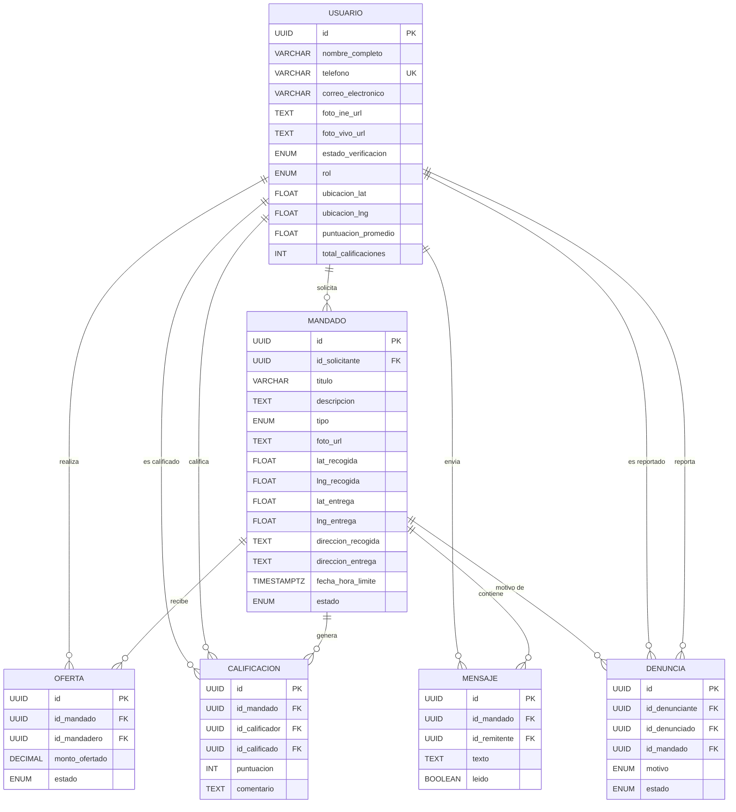

# Modelo de Entidad-Relacion

[//]: # (INICIO_DIAGRAMA)

```mermaid
erDiagram
    USUARIO {
        UUID id PK
        VARCHAR nombre_completo
        VARCHAR telefono UK
        VARCHAR correo_electronico
        TEXT foto_ine_url
        TEXT foto_vivo_url
        ENUM estado_verificacion
        ENUM rol
        FLOAT ubicacion_lat
        FLOAT ubicacion_lng
        FLOAT puntuacion_promedio
        INT total_calificaciones
    }

    MANDADO {
        UUID id PK
        UUID id_solicitante FK
        VARCHAR titulo
        TEXT descripcion
        ENUM tipo
        TEXT foto_url
        FLOAT lat_recogida
        FLOAT lng_recogida
        FLOAT lat_entrega
        FLOAT lng_entrega
        TEXT direccion_recogida
        TEXT direccion_entrega
        TIMESTAMPTZ fecha_hora_limite
        ENUM estado
    }

    OFERTA {
        UUID id PK
        UUID id_mandado FK
        UUID id_mandadero FK
        DECIMAL monto_ofertado
        ENUM estado
    }

    CALIFICACION {
        UUID id PK
        UUID id_mandado FK
        UUID id_calificador FK
        UUID id_calificado FK
        INT puntuacion
        TEXT comentario
    }

    MENSAJE {
        UUID id PK
        UUID id_mandado FK
        UUID id_remitente FK
        TEXT texto
        BOOLEAN leido
    }

    DENUNCIA {
        UUID id PK
        UUID id_denunciante FK
        UUID id_denunciado FK
        UUID id_mandado FK
        ENUM motivo
        ENUM estado
    }

    USUARIO ||--o{ MANDADO : "solicita"
    MANDADO ||--o{ OFERTA : "recibe"
    USUARIO ||--o{ OFERTA : "realiza"
    MANDADO ||--o{ CALIFICACION : "genera"
    USUARIO ||--o{ CALIFICACION : "califica"
    USUARIO ||--o{ CALIFICACION : "es calificado"
    MANDADO ||--o{ MENSAJE : "contiene"
    USUARIO ||--o{ MENSAJE : "envia"
    USUARIO ||--o{ DENUNCIA : "reporta"
    USUARIO ||--o{ DENUNCIA : "es reportado"
    MANDADO ||--o{ DENUNCIA : "motivo de"
```