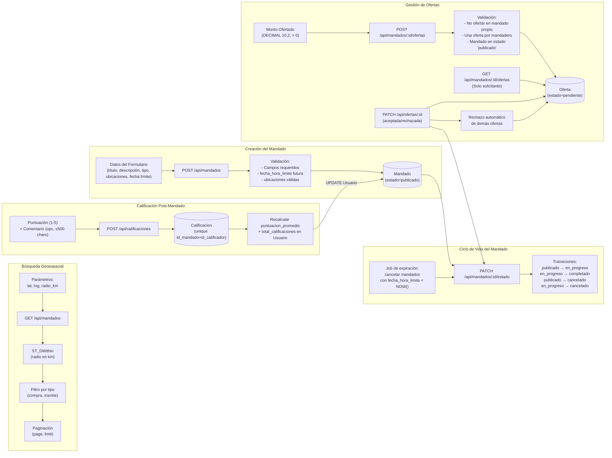

# Diagrama de Flujo de Datos — Mandado

[//]: # (INICIO_DIAGRAMA)

```mermaid
flowchart LR
    subgraph Create["Creación del Mandado"]
        direction TB
        FormData["Datos del Formulario\n(título, descripción, tipo, ubicaciones, fecha límite)"]
        CreateEndpoint["POST /api/mandados"]
        Validate["Validación:\n- Campos requeridos\n- fecha_hora_limite futura\n- ubicaciones válidas"]
        MandadoDB[("Mandado\n(estado=publicado)")]
    end

    subgraph Search["Búsqueda Geoespacial"]
        direction TB
        GeoParams["Parámetros:\nlat, lng, radio_km"]
        SearchEndpoint["GET /api/mandados"]
        PostGISQuery["ST_DWithin\n(radio en km)"]
        FilterType["Filtro por tipo\n(compra, tramite)"]
        Paginate["Paginación\n(page, limit)"]
    end

    subgraph Offers["Gestión de Ofertas"]
        direction TB
        OfferAmount["Monto Ofertado\n(DECIMAL 10,2, > 0)"]
        CreateOffer["POST /api/mandados/:id/ofertas"]
        ValidateOffer["Validación:\n- No ofertar en mandado propio\n- Una oferta por mandadero\n- Mandado en estado 'publicado'"]
        OfertaDB[("Oferta\n(estado=pendiente)")]
        ListOffers["GET /api/mandados/:id/ofertas\n(Solo solicitante)"]
        AcceptReject["PATCH /api/ofertas/:id\n(aceptada/rechazada)"]
        AutoReject["Rechazo automático\nde demás ofertas"]
    end

    subgraph Lifecycle["Ciclo de Vida del Mandado"]
        direction TB
        StateChange["PATCH /api/mandados/:id/estado"]
        Transitions["Transiciones:\npublicado → en_progreso\nen_progreso → completado\npublicado → cancelado\nen_progreso → cancelado"]
        ExpireJob["Job de expiración:\ncancelar mandados\ncon fecha_hora_limite < NOW()"]
    end

    subgraph Ratings["Calificación Post-Mandado"]
        direction TB
        RatingData["Puntuación (1-5)\n+ Comentario (opc, ≤500 chars)"]
        CreateRating["POST /api/calificaciones"]
        RatingDB[("Calificacion\n(unique id_mandado+id_calificador)")]
        RecalcScore["Recalcular puntuacion_promedio\n+ total_calificaciones en Usuario"]
    end

    FormData --> CreateEndpoint
    CreateEndpoint --> Validate
    Validate --> MandadoDB

    GeoParams --> SearchEndpoint
    SearchEndpoint --> PostGISQuery
    PostGISQuery --> FilterType
    FilterType --> Paginate

    OfferAmount --> CreateOffer
    CreateOffer --> ValidateOffer
    ValidateOffer --> OfertaDB
    ListOffers --> OfertaDB
    AcceptReject --> OfertaDB
    AcceptReject --> AutoReject
    AutoReject --> OfertaDB
    AcceptReject --> StateChange

    StateChange --> Transitions
    MandadoDB --> StateChange
    ExpireJob --> StateChange

    RatingData --> CreateRating
    CreateRating --> RatingDB
    RatingDB --> RecalcScore
    RecalcScore -->|"UPDATE Usuario"| MandadoDB
```
