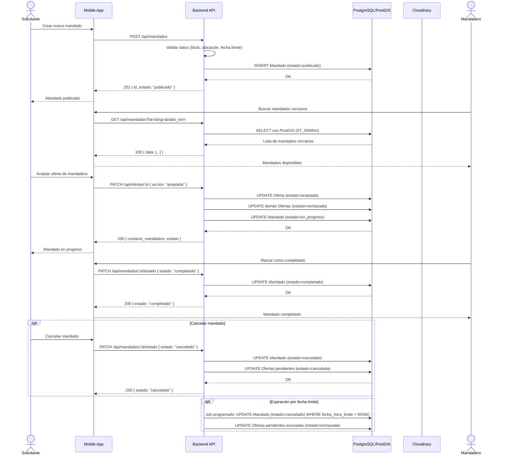

# Diagrama de Secuencia — Ciclo de Vida del Mandado

[//]: # (INICIO_DIAGRAMA)

```mermaid
sequenceDiagram
    actor Solicitante as Solicitante
    participant App as Mobile App
    participant API as Backend API
    participant DB as PostgreSQL/PostGIS
    participant Cloudinary as Cloudinary

    %% Creación del mandado
    Solicitante->>App: Crear nuevo mandado
    App->>API: POST /api/mandados
    API->>API: Validar datos (título, ubicación, fecha límite)
    API->>DB: INSERT Mandado (estado=publicado)
    DB-->>API: OK
    API-->>App: 201 { id, estado: "publicado" }
    App-->>Solicitante: Mandado publicado

    %% Búsqueda por mandaderos
    actor Mandadero as Mandadero
    Mandadero->>App: Buscar mandados cercanos
    App->>API: GET /api/mandados?lat=&lng=&radio_km=
    API->>DB: SELECT con PostGIS (ST_DWithin)
    DB-->>API: Lista de mandados cercanos
    API-->>App: 200 { data: [...] }
    App-->>Mandadero: Mandados disponibles

    %% Cambio de estado: publicado → en_progreso
    Solicitante->>App: Aceptar oferta de mandadero
    App->>API: PATCH /api/ofertas/:id { accion: "aceptada" }
    API->>DB: UPDATE Oferta (estado=aceptada)
    API->>DB: UPDATE demás Ofertas (estado=rechazada)
    API->>DB: UPDATE Mandado (estado=en_progreso)
    DB-->>API: OK
    API-->>App: 200 { contacto_mandadero, estado }
    App-->>Solicitante: Mandado en progreso

    %% Mandado completado
    Mandadero->>App: Marcar como completado
    App->>API: PATCH /api/mandados/:id/estado { estado: "completado" }
    API->>DB: UPDATE Mandado (estado=completado)
    DB-->>API: OK
    API-->>App: 200 { estado: "completado" }
    App-->>Mandadero: Mandado completado

    %% Cancelación (camino alternativo)
    opt Cancelar mandado
        Solicitante->>App: Cancelar mandado
        App->>API: PATCH /api/mandados/:id/estado { estado: "cancelado" }
        API->>DB: UPDATE Mandado (estado=cancelado)
        API->>DB: UPDATE Ofertas pendientes (estado=cancelada)
        DB-->>API: OK
        API-->>App: 200 { estado: "cancelado" }
    end

    %% Expiración automática
    opt Expiración por fecha límite
        API->>DB: Job programado: UPDATE Mandado (estado=cancelado) WHERE fecha_hora_limite < NOW()
        API->>DB: UPDATE Ofertas pendientes asociadas (estado=rechazada)
    end
```
