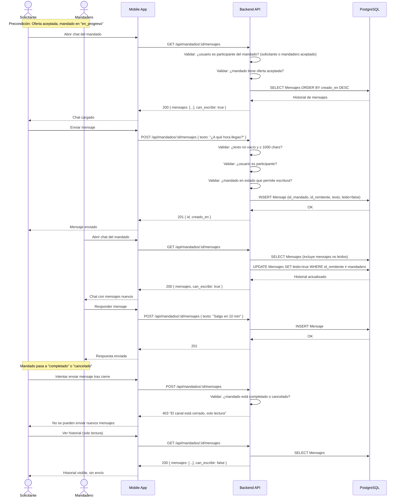

# Diagrama de Secuencia — Mensajería Interna

[//]: # (INICIO_DIAGRAMA)

```mermaid
sequenceDiagram
    actor Solicitante as Solicitante
    actor Mandadero as Mandadero
    participant App as Mobile App
    participant API as Backend API
    participant DB as PostgreSQL

    %% Apertura del canal
    Note over Solicitante,Mandadero: Precondición: Oferta aceptada, mandado en "en_progreso"

    %% Solicitante envía mensaje
    Solicitante->>App: Abrir chat del mandado
    App->>API: GET /api/mandados/:id/mensajes
    API->>API: Validar: ¿usuario es participante del mandado? (solicitante o mandadero aceptado)
    API->>API: Validar: ¿mandado tiene oferta aceptada?
    API->>DB: SELECT Mensajes ORDER BY creado_en DESC
    DB-->>API: Historial de mensajes
    API-->>App: 200 { mensajes: [...], can_escribir: true }
    App-->>Solicitante: Chat cargado

    Solicitante->>App: Enviar mensaje
    App->>API: POST /api/mandados/:id/mensajes { texto: "¿A qué hora llegas?" }
    API->>API: Validar: ¿texto no vacío y ≤ 1000 chars?
    API->>API: Validar: ¿usuario es participante?
    API->>API: Validar: ¿mandado en estado que permite escritura?
    API->>DB: INSERT Mensaje (id_mandado, id_remitente, texto, leido=false)
    DB-->>API: OK
    API-->>App: 201 { id, creado_en }
    App-->>Solicitante: Mensaje enviado

    %% Mandadero lee y responde
    Mandadero->>App: Abrir chat del mandado
    App->>API: GET /api/mandados/:id/mensajes
    API->>DB: SELECT Mensajes (incluye mensajes no leídos)
    API->>DB: UPDATE Mensajes SET leido=true WHERE id_remitente ≠ mandadero
    DB-->>API: Historial actualizado
    API-->>App: 200 { mensajes, can_escribir: true }
    App-->>Mandadero: Chat con mensajes nuevos

    Mandadero->>App: Responder mensaje
    App->>API: POST /api/mandados/:id/mensajes { texto: "Salgo en 10 min" }
    API->>DB: INSERT Mensaje
    DB-->>API: OK
    API-->>App: 201
    App-->>Mandadero: Respuesta enviada

    %% Cierre del canal al completar/cancelar
    Note over Solicitante,Mandadero: Mandado pasa a "completado" o "cancelado"

    Solicitante->>App: Intentar enviar mensaje tras cierre
    App->>API: POST /api/mandados/:id/mensajes
    API->>API: Validar: ¿mandado está completado o cancelado?
    API-->>App: 403 "El canal está cerrado, solo lectura"
    App-->>Solicitante: No se pueden enviar nuevos mensajes

    Solicitante->>App: Ver historial (solo lectura)
    App->>API: GET /api/mandados/:id/mensajes
    API->>DB: SELECT Mensajes
    API-->>App: 200 { mensajes: [...], can_escribir: false }
    App-->>Solicitante: Historial visible, sin envío
```
