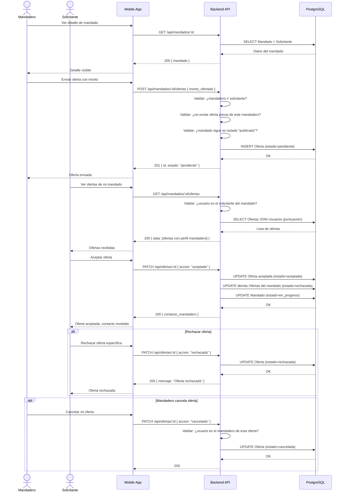

# Diagrama de Secuencia — Flujo de Ofertas

[//]: # (INICIO_DIAGRAMA)

```mermaid
sequenceDiagram
    actor Mandadero as Mandadero
    actor Solicitante as Solicitante
    participant App as Mobile App
    participant API as Backend API
    participant DB as PostgreSQL

    %% Mandadero envía oferta
    Mandadero->>App: Ver detalle de mandado
    App->>API: GET /api/mandados/:id
    API->>DB: SELECT Mandado + Solicitante
    DB-->>API: Datos del mandado
    API-->>App: 200 { mandado }
    App-->>Mandadero: Detalle visible

    Mandadero->>App: Enviar oferta con monto
    App->>API: POST /api/mandados/:id/ofertas { monto_ofertado }
    API->>API: Validar: ¿mandadero ≠ solicitante?
    API->>API: Validar: ¿no existe oferta previa de este mandadero?
    API->>API: Validar: ¿mandado sigue en estado "publicado"?
    API->>DB: INSERT Oferta (estado=pendiente)
    DB-->>API: OK
    API-->>App: 201 { id, estado: "pendiente" }
    App-->>Mandadero: Oferta enviada

    %% Solicitante lista ofertas
    Solicitante->>App: Ver ofertas de mi mandado
    App->>API: GET /api/mandados/:id/ofertas
    API->>API: Validar: ¿usuario es el solicitante del mandado?
    API->>DB: SELECT Ofertas JOIN Usuarios (puntuación)
    DB-->>API: Lista de ofertas
    API-->>App: 200 { data: [ofertas con perfil mandadero] }
    App-->>Solicitante: Ofertas recibidas

    %% Solicitante acepta oferta
    Solicitante->>App: Aceptar oferta
    App->>API: PATCH /api/ofertas/:id { accion: "aceptada" }
    API->>DB: UPDATE Oferta aceptada (estado=aceptada)
    API->>DB: UPDATE demás Ofertas del mandado (estado=rechazada)
    API->>DB: UPDATE Mandado (estado=en_progreso)
    DB-->>API: OK
    API-->>App: 200 { contacto_mandadero }
    App-->>Solicitante: Oferta aceptada, contacto revelado

    %% Solicitante rechaza oferta (camino alternativo)
    alt Rechazar oferta
        Solicitante->>App: Rechazar oferta específica
        App->>API: PATCH /api/ofertas/:id { accion: "rechazada" }
        API->>DB: UPDATE Oferta (estado=rechazada)
        DB-->>API: OK
        API-->>App: 200 { mensaje: "Oferta rechazada" }
        App-->>Solicitante: Oferta rechazada
    end

    %% Mandadero cancela su propia oferta
    opt Mandadero cancela oferta
        Mandadero->>App: Cancelar mi oferta
        App->>API: PATCH /api/ofertas/:id { accion: "cancelada" }
        API->>API: Validar: ¿usuario es el mandadero de esta oferta?
        API->>DB: UPDATE Oferta (estado=cancelada)
        DB-->>API: OK
        API-->>App: 200
    end
```
