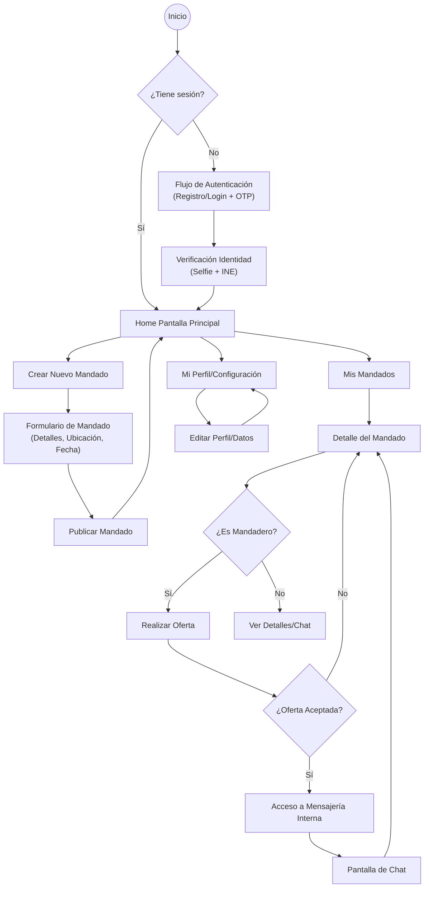

# Diagrama de Pantallas y Navegación

[//]: # (INICIO_DIAGRAMA)

```mermaid
flowchart TD
    Start(("Inicio")) --> Login{"¿Tiene sesión?"}
    Login -- No --> AuthFlow["Flujo de Autenticación\n(Registro/Login + OTP)"]
    Login -- Sí --> Home[Home Pantalla Principal]
    
    AuthFlow --> VerifyID["Verificación Identidad\n(Selfie + INE)"]
    VerifyID --> Home

    Home --> NewMandado["Crear Nuevo Mandado"]
    Home --> ListMandados["Mis Mandados"]
    Home --> Profile["Mi Perfil/Configuración"]

    NewMandado --> FormMandado["Formulario de Mandado\n(Detalles, Ubicación, Fecha)"]
    FormMandado --> Publish["Publicar Mandado"]
    Publish --> Home

    ListMandados --> DetailMandado["Detalle del Mandado"]
    DetailMandado --> OfferAction{"¿Es Mandadero?"}
    OfferAction -- Sí --> MakeOffer["Realizar Oferta"]
    OfferAction -- No --> ViewDetails["Ver Detalles/Chat"]

    MakeOffer --> OfferStatus{"¿Oferta Aceptada?"}
    OfferStatus -- Sí --> ChatAccess["Acceso a Mensajería Interna"]
    OfferStatus -- No --> DetailMandado

    ChatAccess --> ChatScreen["Pantalla de Chat"]
    ChatScreen --> DetailMandado

    Profile --> EditProfile["Editar Perfil/Datos"]
    EditProfile --> Profile
```
