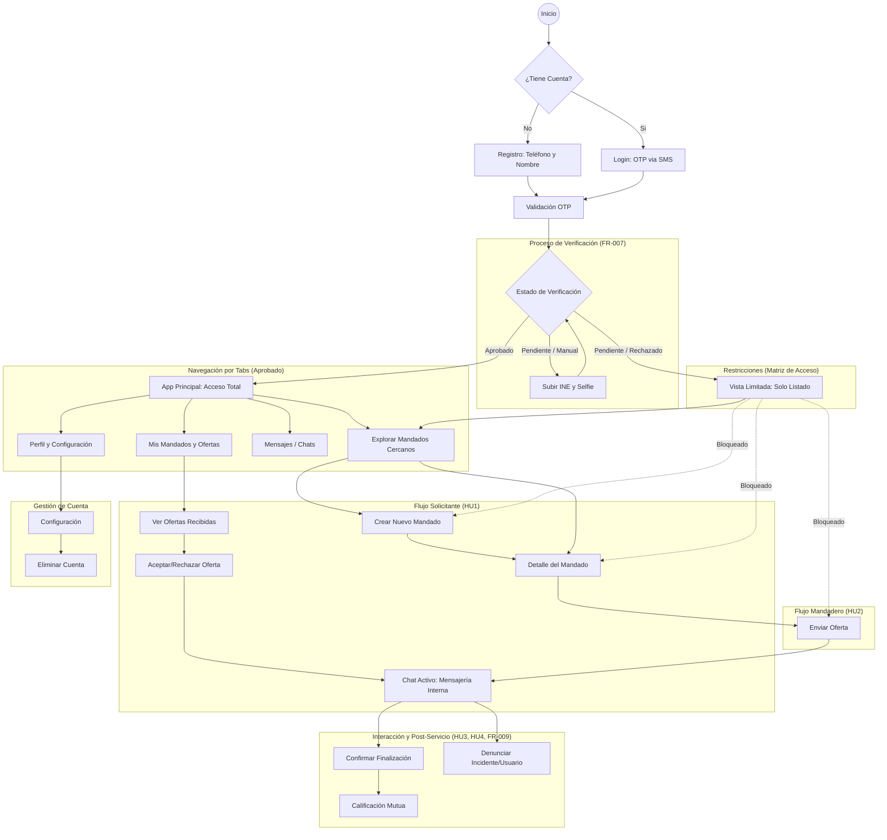

# Flujo de Pantallas

[//]: # (INICIO_DIAGRAMA)

```mermaid
flowchart TD
  Start((Inicio))
  
  %% Autenticación
  Start --> Auth{¿Tiene Cuenta?}
  Auth -- No --> Reg[Registro: Teléfono y Nombre]
  Auth -- Si --> Log[Login: OTP via SMS]
  
  Reg --> OTP[Validación OTP]
  Log --> OTP

  %% Proceso de Verificación de Identidad
  OTP --> VerifCheck{Estado de Verificación}
  
  subgraph "Proceso de Verificación (FR-007)"
    VerifCheck -- "Pendiente / Manual" --> ID_Upload[Subir INE y Selfie]
    ID_Upload --> VerifCheck
  end

  %% Navegación Principal según Estado
  VerifCheck -- "Aprobado" --> MainTabs[App Principal: Acceso Total]
  VerifCheck -- "Pendiente / Rechazado" --> LimitedView[Vista Limitada: Solo Listado]

  subgraph "Navegación por Tabs (Aprobado)"
    MainTabs --> TabHome[Explorar Mandados Cercanos]
    MainTabs --> TabMyTasks[Mis Mandados y Ofertas]
    MainTabs --> TabChat[Mensajes / Chats]
    MainTabs --> TabProfile[Perfil y Configuración]
  end

  %% Flujo de Solicitante
  subgraph "Flujo Solicitante (HU1)"
    TabHome --> CreateM[Crear Nuevo Mandado]
    CreateM --> DetailM[Detalle del Mandado]
    TabMyTasks --> ViewOffers[Ver Ofertas Recibidas]
    ViewOffers --> AcceptOffer[Aceptar/Rechazar Oferta]
    AcceptOffer --> ChatRoom
  end

  %% Flujo de Mandadero
  subgraph "Flujo Mandadero (HU2)"
    TabHome --> DetailM
    DetailM --> SendOffer[Enviar Oferta]
    SendOffer --> ChatRoom
  end

  %% Interacción y Cierre
  subgraph "Interacción y Post-Servicio (HU3, HU4, FR-009)"
    ChatRoom[Chat Activo: Mensajería Interna] --> CompleteTask[Confirmar Finalización]
    CompleteTask --> Rating[Calificación Mutua]
    ChatRoom --> Report[Denunciar Incidente/Usuario]
  end

  %% Restricciones de la Matriz de Acceso
  subgraph "Restricciones (Matriz de Acceso)"
    LimitedView --> TabHome
    LimitedView -.-> |Bloqueado| CreateM
    LimitedView -.-> |Bloqueado| SendOffer
    LimitedView -.-> |Bloqueado| DetailM
  end

  %% Perfil y Cuenta
  subgraph "Gestión de Cuenta"
    TabProfile --> Settings[Configuración]
    Settings --> DeleteAcc[Eliminar Cuenta]
  end
```