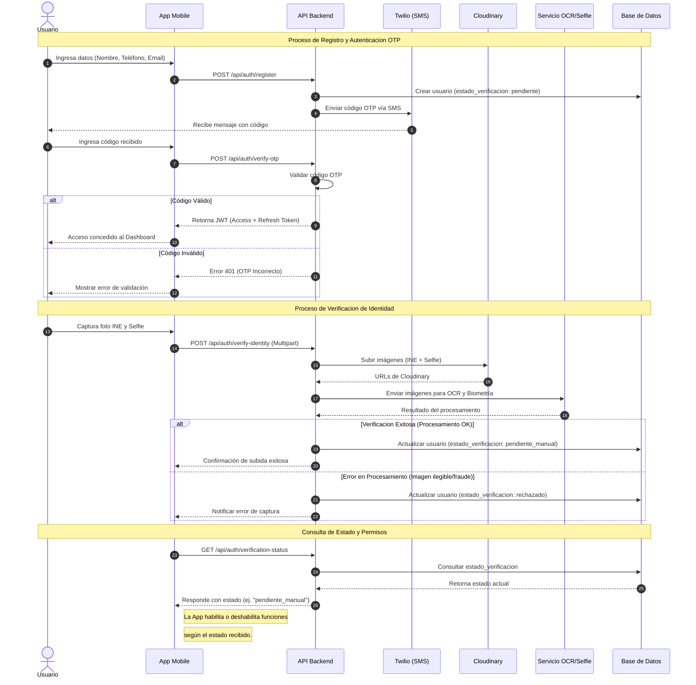

# Secuencia de Autenticacion y Verificacion

[//]: # (INICIO_DIAGRAMA)

```mermaid
sequenceDiagram
  autonumber
  actor U as Usuario
  participant A as App Mobile
  participant B as API Backend
  participant T as Twilio (SMS)
  participant C as Cloudinary
  participant S as Servicio OCR/Selfie
  participant DB as Base de Datos

  Note over U, DB: Proceso de Registro y Autenticacion OTP

  U->>A: Ingresa datos (Nombre, Teléfono, Email)
  A->>B: POST /api/auth/register
  B->>DB: Crear usuario (estado_verificacion: pendiente)
  B->>T: Enviar código OTP vía SMS
  T-->>U: Recibe mensaje con código
  U->>A: Ingresa código recibido
  A->>B: POST /api/auth/verify-otp
  B->>B: Validar código OTP
  alt Código Válido
    B-->>A: Retorna JWT (Access + Refresh Token)
    A-->>U: Acceso concedido al Dashboard
  else Código Inválido
    B-->>A: Error 401 (OTP Incorrecto)
    A-->>U: Mostrar error de validación
  end

  Note over U, DB: Proceso de Verificacion de Identidad

  U->>A: Captura foto INE y Selfie
  A->>B: POST /api/auth/verify-identity (Multipart)
  B->>C: Subir imágenes (INE + Selfie)
  C-->>B: URLs de Cloudinary
  B->>S: Enviar imágenes para OCR y Biometría
  S-->>B: Resultado del procesamiento

  alt Verificacion Exitosa (Procesamiento OK)
    B->>DB: Actualizar usuario (estado_verificacion: pendiente_manual)
    B-->>A: Confirmación de subida exitosa
  else Error en Procesamiento (Imagen ilegible/fraude)
    B->>DB: Actualizar usuario (estado_verificacion: rechazado)
    B-->>A: Notificar error de captura
  end

  Note over U, DB: Consulta de Estado y Permisos

  A->>B: GET /api/auth/verification-status
  B->>DB: Consultar estado_verificacion
  DB-->>B: Retorna estado actual
  B-->>A: Responde con estado (ej. "pendiente_manual")
  
  Note right of A: La App habilita o deshabilita funciones
  Note right of A: según el estado recibido.
```