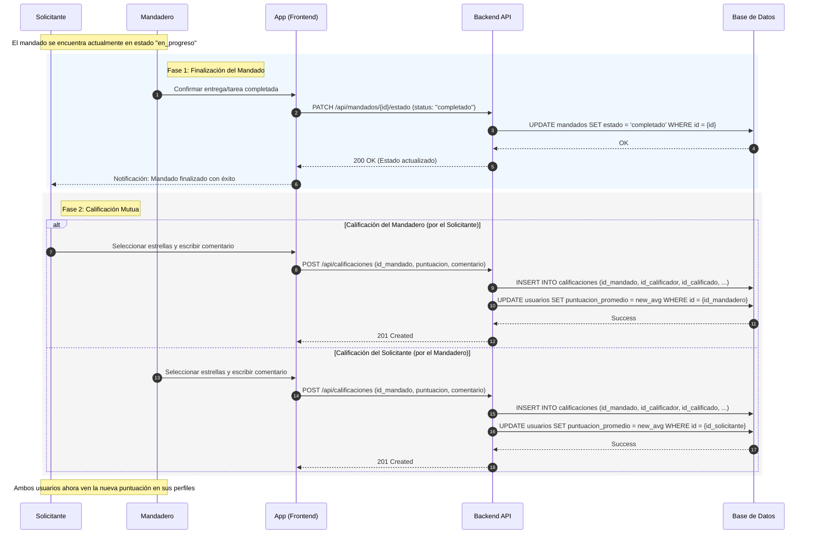

# Secuencia de Finalizacion y Calificacion

[//]: # (INICIO_DIAGRAMA)

```mermaid
sequenceDiagram
  autonumber
  participant S as Solicitante
  participant M as Mandadero
  participant A as App (Frontend)
  participant B as Backend API
  participant D as Base de Datos

  Note over S, M: El mandado se encuentra actualmente en estado "en_progreso"

  rect rgb(240, 248, 255)
    Note right of M: Fase 1: Finalización del Mandado
    M->>A: Confirmar entrega/tarea completada
    A->>B: PATCH /api/mandados/{id}/estado (status: "completado")
    B->>D: UPDATE mandados SET estado = 'completado' WHERE id = {id}
    D-->>B: OK
    B-->>A: 200 OK (Estado actualizado)
    A-->>S: Notificación: Mandado finalizado con éxito
  end

  rect rgb(245, 245, 245)
    Note right of S: Fase 2: Calificación Mutua
    
    alt Calificación del Mandadero (por el Solicitante)
      S->>A: Seleccionar estrellas y escribir comentario
      A->>B: POST /api/calificaciones (id_mandado, puntuacion, comentario)
      B->>D: INSERT INTO calificaciones (id_mandado, id_calificador, id_calificado, ...)
      B->>D: UPDATE usuarios SET puntuacion_promedio = new_avg WHERE id = {id_mandadero}
      D-->>B: Success
      B-->>A: 201 Created
    else Calificación del Solicitante (por el Mandadero)
      M->>A: Seleccionar estrellas y escribir comentario
      A->>B: POST /api/calificaciones (id_mandado, puntuacion, comentario)
      B->>D: INSERT INTO calificaciones (id_mandado, id_calificador, id_calificado, ...)
      B->>D: UPDATE usuarios SET puntuacion_promedio = new_avg WHERE id = {id_solicitante}
      D-->>B: Success
      B-->>A: 201 Created
    end
  end

  Note over S, M: Ambos usuarios ahora ven la nueva puntuación en sus perfiles
```