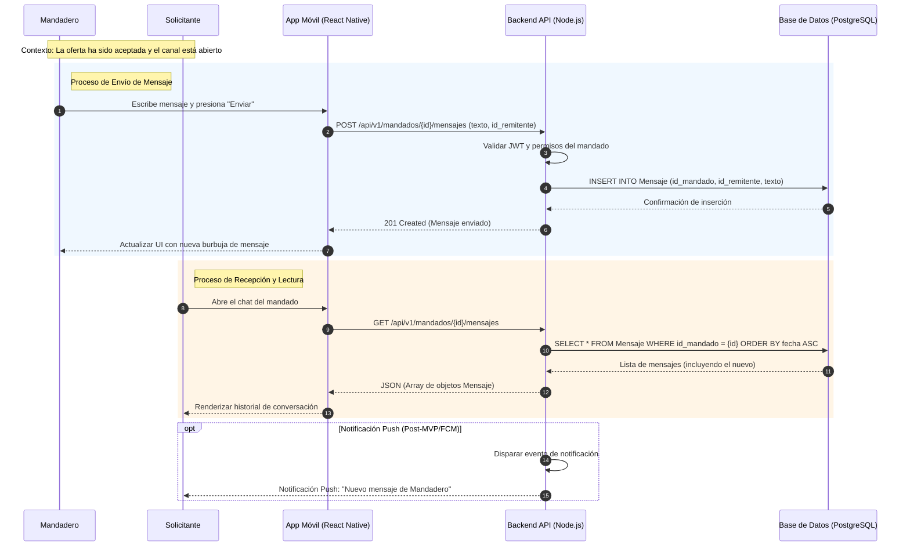

# Secuencia de Mensajeria Interna

[//]: # (INICIO_DIAGRAMA)

```mermaid
sequenceDiagram
  autonumber
  participant M as Mandadero
  participant S as Solicitante
  participant App as App Móvil (React Native)
  participant API as Backend API (Node.js)
  participant DB as Base de Datos (PostgreSQL)

  Note over M, S: Contexto: La oferta ha sido aceptada y el canal está abierto

  rect rgb(240, 248, 255)
    Note right of M: Proceso de Envío de Mensaje
    M->>App: Escribe mensaje y presiona "Enviar"
    App->>API: POST /api/v1/mandados/{id}/mensajes (texto, id_remitente)
    API->>API: Validar JWT y permisos del mandado
    API->>DB: INSERT INTO Mensaje (id_mandado, id_remitente, texto)
    DB-->>API: Confirmación de inserción
    API-->>App: 201 Created (Mensaje enviado)
    App-->>M: Actualizar UI con nueva burbuja de mensaje
  end

  rect rgb(255, 245, 230)
    Note right of S: Proceso de Recepción y Lectura
    S->>App: Abre el chat del mandado
    App->>API: GET /api/v1/mandados/{id}/mensajes
    API->>DB: SELECT * FROM Mensaje WHERE id_mandado = {id} ORDER BY fecha ASC
    DB-->>API: Lista de mensajes (incluyendo el nuevo)
    API-->>App: JSON (Array de objetos Mensaje)
    App-->>S: Renderizar historial de conversación
  end

  opt Notificación Push (Post-MVP/FCM)
    API->>API: Disparar evento de notificación
    API-->>S: Notificación Push: "Nuevo mensaje de Mandadero"
  end
```