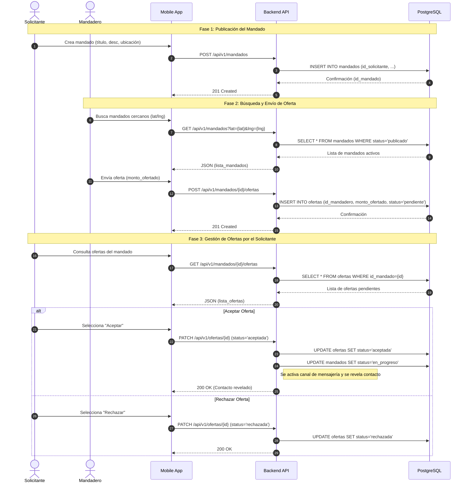

# Secuencia de Creacion y Aceptacion de Ofertas

[//]: # (INICIO_DIAGRAMA)

```mermaid
sequenceDiagram
  autonumber
  actor Solicitante
  actor Mandadero
  participant App as Mobile App
  participant API as Backend API
  participant DB as PostgreSQL

  Note over Solicitante, DB: Fase 1: Publicación del Mandado
  Solicitante->>App: Crea mandado (título, desc, ubicación)
  App->>API: POST /api/v1/mandados
  API->>DB: INSERT INTO mandados (id_solicitante, ...)
  DB-->>API: Confirmación (id_mandado)
  API-->>App: 201 Created

  Note over Mandadero, DB: Fase 2: Búsqueda y Envío de Oferta
  Mandadero->>App: Busca mandados cercanos (lat/lng)
  App->>API: GET /api/v1/mandados?lat={lat}&lng={lng}
  API->>DB: SELECT * FROM mandados WHERE status='publicado'
  DB-->>API: Lista de mandados activos
  API-->>App: JSON (lista_mandados)
  Mandadero->>App: Envía oferta (monto_ofertado)
  App->>API: POST /api/v1/mandados/{id}/ofertas
  API->>DB: INSERT INTO ofertas (id_mandadero, monto_ofertado, status='pendiente')
  DB-->>API: Confirmación
  API-->>App: 201 Created

  Note over Solicitante, DB: Fase 3: Gestión de Ofertas por el Solicitante
  Solicitante->>App: Consulta ofertas del mandado
  App->>API: GET /api/v1/mandados/{id}/ofertas
  API->>DB: SELECT * FROM ofertas WHERE id_mandado={id}
  DB-->>API: Lista de ofertas pendientes
  API-->>App: JSON (lista_ofertas)

  alt Aceptar Oferta
    Solicitante->>App: Selecciona "Aceptar"
    App->>API: PATCH /api/v1/ofertas/{id} (status='aceptada')
    API->>DB: UPDATE ofertas SET status='aceptada'
    API->>DB: UPDATE mandados SET status='en_progreso'
    Note right of API: Se activa canal de mensajería y se revela contacto
    API-->>App: 200 OK (Contacto revelado)
  else Rechazar Oferta
    Solicitante->>App: Selecciona "Rechazar"
    App->>API: PATCH /api/v1/ofertas/{id} (status='rechazada')
    API->>DB: UPDATE ofertas SET status='rechazada'
    API-->>App: 200 OK
  end
```